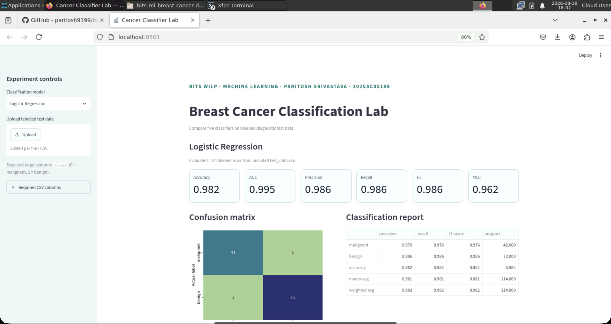
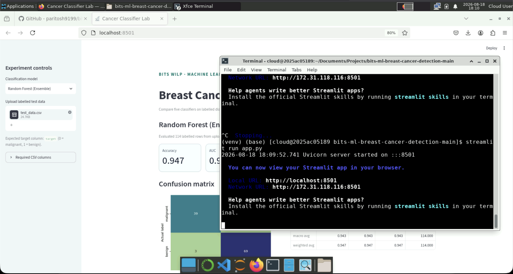
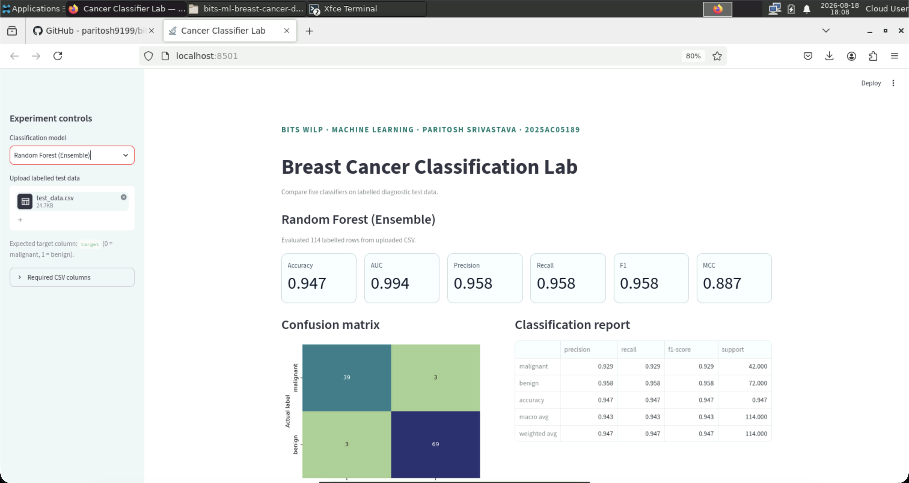

# PARITOSH SRIVASTAVA - 2025AC05189 - ML Assignment 2

---

# Breast Cancer Classification Lab

An interactive machine-learning application that compares five classification models on the Breast Cancer Wisconsin (Diagnostic) dataset. The application accepts labelled test data as a CSV file and displays the required evaluation metrics, confusion matrix, and classification report.

- **GitHub repository:** [https://github.com/paritosh9199/bits-ml-breast-cancer-detection](https://github.com/paritosh9199/bits-ml-breast-cancer-detection)
- **Live Streamlit application:** [https://bits-ml-breast-cancer-detection-kragyurz5mw7sfmb9xuyrs.streamlit.app/](https://bits-ml-breast-cancer-detection-kragyurz5mw7sfmb9xuyrs.streamlit.app/)

### Running application in Bits Virtual LAB:





> Running classification from test_data.csv


## a. Problem statement

The objective is to build an end-to-end classification workflow that predicts whether a breast mass is **malignant** or **benign** from numerical measurements computed from a digitized image of a fine-needle aspirate of the mass.

The project trains and evaluates all five classifiers explicitly listed in the assignment:

1. Logistic Regression
2. Decision Tree Classifier
3. k-Nearest Neighbors Classifier
4. Gaussian Naive Bayes Classifier
5. Random Forest Classifier (ensemble model)

The trained pipelines are presented through a Streamlit application. A user can upload labelled test data, select a model, and examine its evaluation results interactively.

## b. Dataset description

This project uses the **Breast Cancer Wisconsin (Diagnostic)** dataset, originally published through the UCI Machine Learning Repository and included with scikit-learn.

| Property | Description |
|---|---|
| Problem type | Binary classification |
| Total instances | 569 |
| Input features | 30 numerical features |
| Target classes | `0` = malignant, `1` = benign |
| Missing values | None in the original scikit-learn dataset |
| Assignment minimum | At least 500 instances and 12 features |
| Requirement satisfied | Yes |

The features describe characteristics such as radius, texture, perimeter, area, smoothness, compactness, concavity, symmetry, and fractal dimension. For each characteristic, the dataset includes mean, standard-error, and worst-value measurements.

A stratified 80:20 train-test split is created with `random_state=42`:

- Training data: 455 records
- Test data: 114 records

The committed [`test_data.csv`](test_data.csv) file contains the holdout records used by the application. It includes all 30 feature columns and the labelled `target` column. Uploaded data is used only for evaluation; the application does not retrain models from uploaded files.

Dataset references:

- [UCI Breast Cancer Wisconsin (Diagnostic) dataset](https://archive.ics.uci.edu/dataset/17/breast+cancer+wisconsin+diagnostic)
- [scikit-learn load_breast_cancer documentation](https://scikit-learn.org/stable/modules/generated/sklearn.datasets.load_breast_cancer.html)

## c. GitHub Repository Link

**Repository link:** [https://github.com/paritosh9199/bits-ml-breast-cancer-detection](https://github.com/paritosh9199/bits-ml-breast-cancer-detection)

The repository contains the complete source code, dependency list, test CSV, reusable training code, and saved artifacts for every implemented model.

## d. Models used and evaluation results

All models are trained on the same training partition and evaluated on the same stratified test partition. Median imputation is included for safe handling of missing numerical values in uploaded data. Standardization is applied to Logistic Regression, kNN, and Gaussian Naive Bayes. Tree-based models use the unscaled numerical features.

The six metrics required by the assignment are Accuracy, Area Under the ROC Curve (AUC), Precision, Recall, F1 Score, and Matthews Correlation Coefficient (MCC).

### Model comparison table

| ML Model Name | Accuracy | AUC | Precision | Recall | F1 | MCC |
|---|---:|---:|---:|---:|---:|---:|
| Logistic Regression | **0.982** | **0.995** | **0.986** | 0.986 | **0.986** | **0.962** |
| Decision Tree | 0.912 | 0.915 | 0.956 | 0.903 | 0.929 | 0.817 |
| kNN | 0.974 | 0.988 | 0.960 | **1.000** | 0.980 | 0.944 |
| Naive Bayes | 0.930 | 0.987 | 0.944 | 0.944 | 0.944 | 0.849 |
| Random Forest (Ensemble) | 0.947 | 0.994 | 0.958 | 0.958 | 0.958 | 0.887 |

The displayed values are rounded to three decimal places. Full-precision results are available in [`model/artifacts/baseline_metrics.csv`](model/artifacts/baseline_metrics.csv).

### Observations about model performance

| ML Model Name | Observation about model performance |
|---|---|
| Logistic Regression | It provides the best overall balance, with the highest Accuracy, AUC, Precision, F1, and MCC. Feature scaling helps the regularized linear classifier work with measurements that have different numerical ranges. |
| Decision Tree | It has the lowest AUC and MCC on the test set. Although a single tree is interpretable, its lower scores indicate less stable generalization than the other models in this experiment. |
| kNN | It obtains perfect Recall and the second-highest F1 and MCC. It identifies every positive-class record in this split, although its Precision is slightly below Logistic Regression. Its strong result also demonstrates the importance of scaling distance-based features. |
| Naive Bayes | It produces a strong AUC but lower Accuracy and MCC. This suggests that probability ranking is effective, while the Gaussian conditional-independence assumption limits some final class decisions. |
| Random Forest (Ensemble) | It improves substantially over the single Decision Tree in AUC, F1, and MCC, demonstrating the stability gained by combining many trees. On this dataset, it still does not outperform the scaled linear and neighbor-based models. |
| Overall Winner | **Logistic Regression** is the overall winner because it leads the broadest set of evaluation metrics. kNN is a close alternative when maximizing Recall is the main objective. |

## Streamlit application features

The application implements every frontend feature requested in the assignment:

- Upload of labelled test data in CSV format
- Dropdown for selecting any of the five trained models
- Display of Accuracy, AUC, Precision, Recall, F1, and MCC
- Confusion matrix with light/dark theme-compatible styling
- Detailed classification report
- Preview of actual and predicted values
- Validation and a clear error message when required CSV columns are missing

## Repository structure

```text
.
├── app.py
├── train_models.py
├── requirements.txt
├── README.md
├── test_data.csv
└── model/
    ├── __init__.py
    ├── modeling.py
    └── artifacts/
        ├── baseline_metrics.csv
        ├── metadata.joblib
        ├── logistic_regression.joblib
        ├── decision_tree.joblib
        ├── knn.joblib
        ├── naive_bayes.joblib
        └── random_forest_ensemble.joblib
```

## Run the project locally

### 1. Create and activate a virtual environment

```bash
python3 -m venv .venv
source .venv/bin/activate
```

On Windows, activate it with:

```powershell
.venv\Scripts\activate
```

### 2. Install dependencies

```bash
python -m pip install -r requirements.txt
```

### 3. Regenerate the models and test data if required

The trained artifacts and test data are already included. To reproduce them:

```bash
python train_models.py
```

### 4. Start the Streamlit application

```bash
streamlit run app.py
```

Open `http://localhost:8501` if the browser does not open automatically. Upload [`test_data.csv`](test_data.csv), select a classifier from the sidebar, and review the results.

## Deployment

The application is intended for deployment through Streamlit Community Cloud using `app.py` as its entry point.

## Reproducibility

- Train-test split: stratified 80:20
- Random seed: `42`
- Evaluation data: the same 114-record holdout set for every classifier
- Saved objects: complete preprocessing and classification pipelines
- Dependencies: documented in [`requirements.txt`](requirements.txt)

